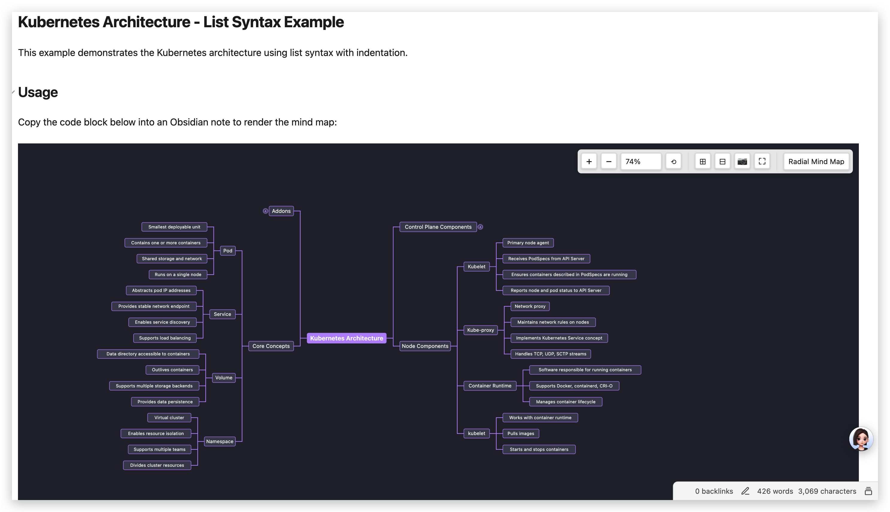
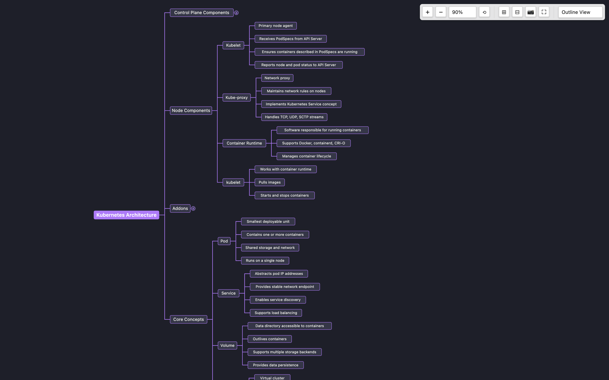
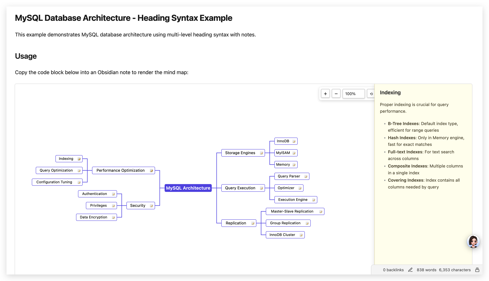
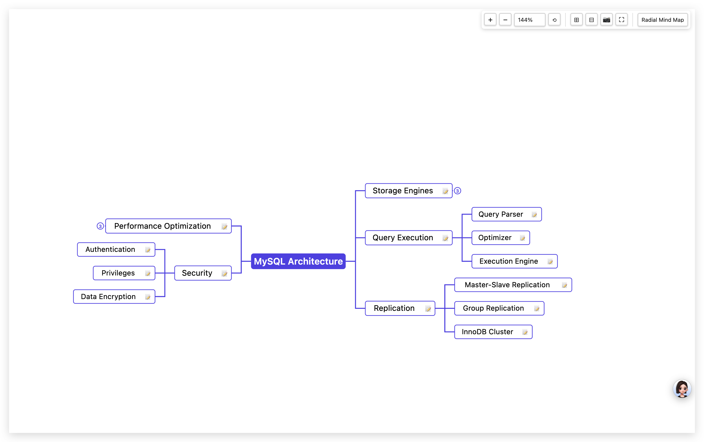

# Mindmark - Obsidian Mind Map Plugin

A powerful Obsidian plugin that renders Markdown lists and multi-level headings into interactive mind maps.



[中文文档](README_ZH.md)

---

## ✨ Features

### 🎨 Dual Render Modes
- **Outline View**: Horizontal left-to-right layout, perfect for hierarchical structures
- **Radial Mind Map**: Symmetrical left-right layout, ideal for central themes

### 🎨 Rich Theme System
- **13 Preset Themes**: Default, Dark, Darcula, Dracula, Monokai, Solarized Dark/Light, Ocean, Forest, Sunset, Lavender, Mint, Rose
- **Custom Themes**: Create and save your own color schemes
- **5 Color Configurations**: Canvas background, font color, node background, line color, connection color
- **Real-time Preview**: Color changes apply immediately to all mind maps

### 📝 Smart Content Recognition
- **Multi-level Heading Mode**: Automatically recognizes `##`, `###` etc. Headings, with content below as notes
- **List Mode**: Supports indented lists starting with `-` or `*`, with `#` as root heading

### 🎯 Interactive Experience
- **Click to Expand/Collapse**: Click nodes or circles to expand or collapse child nodes
- **Notes Display**: Supports Markdown-formatted notes, click 📝 icon to view in right panel
- **Zoom Controls**:
  - Zoom percentage selector (25%, 50%, 75%, 100%, 125%, 150%, 200%, 300%, 400%)
  - +/- button zoom
  - Mouse wheel zoom (configurable)
  - Trackpad pinch zoom (macOS) and touch screen pinch zoom (configurable)
  - Reset zoom button
- **Pan Support**: Mouse drag to pan the canvas
- **Fullscreen Mode**: Click fullscreen button for immersive viewing, theme color auto-syncs
- **One-click Copy**: Click 📷 button to copy mind map as high-definition PNG image
- **Expand/Collapse All**: One-click expand (⊞) or collapse (⊟) all nodes

### 🎨 Visual Design
- **Professional Color Schemes**: Multiple themes for different scenarios
- **Adaptive Layout**: Auto-center display, supports any size
- **Smooth Animations**: Panel slide-in/out, smooth operations
- **Preview Mode Optimization**: Correct display in preview mode, no horizontal scrolling issues

## 📦 Installation

### Manual Installation
1. Download and extract the plugin
2. Rename folder to `obsidian-mindmap`
3. Copy to Obsidian plugins directory:
   - **macOS**: `~/Library/Application Support/obsidian/plugins/`
   - **Windows**: `%APPDATA%\obsidian/plugins/`
   - **Linux**: `~/.config/obsidian/plugins/`
4. Enable "Mindmark" in Obsidian Settings → Community Plugins

### Development Installation
```bash
git clone https://github.com/iFaceless/obsidian-mindmap.git
cd obsidian-mindmap
npm install
npm run build
```

## 🚀 Usage

### Basic Usage

Create a code block in Obsidian notes using `mindmap` as the language identifier:

````markdown
```mindmap
- Core Architecture
  - Model (Brain)
    - Selection Principle: Business-driven
    - Multi-model Strategy
  - Tools (Arms)
    - Retrieve Real-world Information
    - Execute Actions
  - Orchestration Layer
    - Planning
    - Memory Management
```
````

### Multi-level Heading Mode

Use Markdown multi-level headings to create mind maps. Content below headings is automatically recognized as notes:

````markdown
```mindmap
## Technology
### Fundamentals
Fundamentals are a **long-term investment**. Short-term gains may not be obvious, but they determine your career ceiling.

#### Algorithms
Problem-solving strategies and insights:
- **LeetCode Hot 100** is the most core question bank, prioritize it
- Common question types: `*` indicates high frequency
  - 1. Linked List: `Reverse Linked List`, `Linked List Cycle`, `Merge K Sorted Lists`
  - 2. Binary Tree: `Level Order Traversal`, `Path Sum`, `Lowest Common Ancestor`
  - 3. Dynamic Programming: `Knapsack Problem`, `Longest Increasing Subsequence`, `Edit Distance`
  - 4. DFS/BFS: `Number of Islands`, `Course Schedule`, `Matrix Shortest Path`
- Interview tips: **Explain approach first, then write code, finally analyze complexity**
```
````

### List Mode with Root Heading

Use `#` heading as root node, child nodes use `-` or `*`:

````markdown
```mindmap
# Day_1_v4

## Introduction
- Definition: AI system combining model, tools, orchestration layer
- Goal: Transition from predictive AI to autonomous agents

## Core Architecture
- Model (Brain)
  - Selection Principle: Business-driven
  - Multi-model Strategy: Choose different models based on task characteristics
- Tools (Arms)
  - Function Categories: Retrieve real-world information, execute actions
- Orchestration Layer (Neural Network)
  - Role: Planning, memory management, decision execution
```
````

## 🎮 Interactive Operations

| Operation | Function |
|-----------|----------|
| **Click node text** | Expand or collapse child nodes |
| **Click hollow circle** | Expand or collapse child nodes |
| **Click 📝 icon** | Display notes in right panel |
| **Click canvas blank area** | Hide notes panel |
| **Mouse drag** | Pan canvas |
| **Mouse wheel** | Zoom canvas (enable in settings) |
| **Trackpad pinch** | Zoom canvas (macOS, enable in settings) |
| **Touch screen pinch** | Zoom canvas (enable in settings) |
| **Click +/- buttons** | Zoom in/out |
| **Select zoom level** | Choose common zoom levels from dropdown |
| **Click 🎯 button** | Reset zoom and position |
| **Click 📷 button** | Copy as PNG image |
| **Click ⛶ button** | Toggle fullscreen mode |
| **Click ⊞ button** | Expand all nodes |
| **Click ⊟ button** | Collapse all nodes |
| **Dropdown selection** | Switch render mode |

## ⚙️ Settings

### Theme Settings
- **Theme**: Select preset theme or Custom mode
- **Save current settings as custom theme**: Save current color settings as custom theme (only in Custom mode)
- **Delete custom theme**: Delete custom theme (only in Custom mode)

### Color Settings (Custom mode only)
- **Canvas background color**: Canvas background color
- **Font color**: Node text color
- **Node background color**: Node background color
- **Line color**: Node border and outline color
- **Connection color**: Connection line color between nodes

### General Settings
- **Default render mode**: Select default render mode (Outline View / Radial Mind Map)
- **Enable mouse wheel zoom**: Enable mouse wheel zoom (default: disabled)
- **Enable pinch zoom**: Enable trackpad pinch zoom and touch screen pinch zoom (default: disabled)
- **Note panel width**: Notes panel width (200-800px)

### Preset Themes

| Theme Name | Style | Use Case |
|------------|-------|----------|
| Default | White background, black text, purple lines | General purpose |
| Dark | Dark theme | Dark mode |
| Darcula | IntelliJ IDEA classic dark | Developers |
| Dracula | Popular dark theme | Developers |
| Monokai | Classic code editor theme | Developers |
| Solarized Dark | Solarized dark | Developers |
| Solarized Light | Solarized light | Developers |
| Ocean | Ocean blue tones | Fresh style |
| Forest | Forest green tones | Natural style |
| Sunset | Sunset orange-red tones | Warm style |
| Lavender | Lavender purple tones | Elegant style |
| Mint | Mint cyan tones | Fresh style |
| Rose | Rose pink tones | Soft style |

## 📸 Render Examples

### List Syntax Example


### List Syntax Example (Expanded)


### Multi-level Heading Syntax Example


### Multi-level Heading Syntax Example (with Notes)


### Settings Interface


## 💡 Tips

1. **Quick Mode Switch**: Use dropdown menu in control panel to quickly switch render modes
2. **Theme Switching**: Choose appropriate theme for your scenario, or create custom theme
3. **Precise Zoom**: Use zoom percentage selector to quickly jump to common zoom levels
4. **Fullscreen Viewing**: Click fullscreen button for immersive viewing, theme color auto-syncs
5. **Export Image**: Click 📷 button to copy mind map as HD PNG, paste directly into documents
6. **Notes Management**: In multi-level heading mode, all content below headings becomes notes, supports full Markdown format
7. **Smart Recognition**: Plugin automatically recognizes content type, no manual mode selection needed
8. **Custom Themes**: Adjust colors and save as custom theme for future use
9. **Expand/Collapse All**: Use ⊞ to expand all nodes or ⊟ to collapse all nodes for quick navigation

## 🔧 Development

```bash
# Install dependencies
npm install

# Development mode (auto-rebuild)
npm run dev

# Production build
npm run build
```

## 📝 Changelog

### v1.2.0
- ✨ Add expand all (⊞) and collapse all (⊟) buttons to control panel
- ✨ Add trackpad pinch zoom support for macOS (wheel + ctrlKey)
- ✨ Add Safari gesture event support for pinch zoom
- ✨ Add touch screen pinch zoom support
- 🐛 Fix extra line segments on leaf node rectangles
- 🎨 Optimize connection line endpoints for consistent 3px spacing
- 🎨 Unify circle radius to 5 for both left and right sides

### v1.1.0
- ✨ Add complete theme system with 13 preset themes
- ✨ Support custom theme creation, saving, and deletion
- ✨ Add zoom percentage selector (25%-400%)
- ✨ Add fullscreen mode with theme color auto-sync
- 🐛 Fix notes panel display in preview mode
- 🐛 Fix canvas width overflow in preview mode
- 🐛 Fix background color flicker when toggling fullscreen
- 🎨 Rename settings page to "Mindmark Settings"

### v1.0.0
- ✨ Support two render modes: Outline View and Radial Mind Map
- ✨ Smart content recognition: multi-level heading mode and list mode
- ✨ Right-side notes panel with Markdown rendering
- ✨ One-click copy as HD PNG image
- ✨ Click node to expand/collapse
- ✨ Zoom and pan support
- 🎨 Professional visual design

## 📄 License

MIT License

## 🤝 Contributing

Issues and Pull Requests are welcome!

## 📧 Contact

- GitHub: [iFaceless/obsidian-mindmap](https://github.com/iFaceless/obsidian-mindmap)